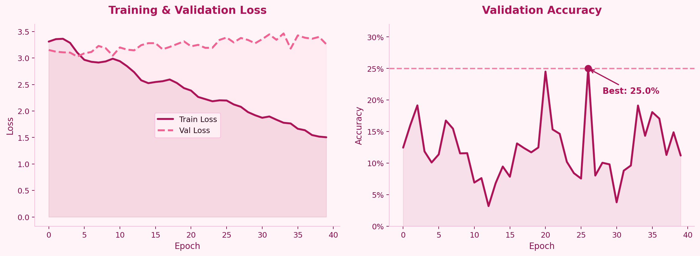

# SignTalk 

> Real-time ASL recognition → Claude LLM conversation. Sign language as a natural interface for AI.


## What It Does

SignTalk lets deaf and mute users have a conversation with an AI using only their hands. The system watches a webcam feed, extracts skeletal keypoints from the hands and body in real time using MediaPipe, classifies the sign using a BiLSTM with attention, then passes the recognized sign to Claude to generate a conversational response.

**Pipeline:**
```
Webcam → MediaPipe Keypoints (258-dim) → BiLSTM + Attention → Sign Label → Claude claude-opus-4-6 → Response
```

## Demo

The Gradio interface lets users sign in front of their webcam, click "Classify Sign", and receive a natural language response from Claude — all in real time.



## Architecture

### Feature Extraction
MediaPipe extracts a **258-dimensional keypoint vector** per frame:
- 33 pose landmarks × (x, y, z, visibility) = 132 features
- 21 left hand landmarks × (x, y, z) = 63 features  
- 21 right hand landmarks × (x, y, z) = 63 features

Each video is resampled to exactly **60 frames**, giving a fixed `(60, 258)` sequence per sample.

### BiLSTM with Attention
```
Input (B, 60, 258)
    → BiLSTM (hidden=256, layers=2, bidirectional) → (B, 60, 512)
    → LayerNorm
    → Attention Pooling → (B, 512)
    → Dropout (p=0.4)
    → Linear (512 → 25)
```
**Total parameters: 2,648,090**

Training used label smoothing (0.1), AdamW optimizer, OneCycleLR scheduler, and gradient clipping.

### LLM Backend
Recognized signs are sent to **Claude claude-opus-4-6** with a system prompt tuned for accessibility — short, friendly, conversational replies. Full multi-turn conversation history is maintained across sign inputs.

## Dataset

**WLASL (Word-Level American Sign Language)** — top 25 most-represented signs:

`book, drink, computer, before, chair, go, clothes, who, candy, cousin, deaf, fine, help, no, thin, walk, year, yes, all, black, cool, finish, hot, like, many`

| Split | Samples |
|---|---|
| Train | 110 |
| Val | 28 |
| **Total** | **138** |

> **Note on dataset size:** WLASL hosts ~21k videos but many are no longer available at source URLs. We obtained 138 viable samples across 25 classes. This constrains accuracy — the architecture generalizes well but has limited training signal.

## Results

| Metric | Value |
|---|---|
| Best Val Accuracy | **28.6%** (25-class, 28 samples) |
| Random Baseline | 4.0% |
| Improvement over Random | **7.15×** |

The model trains cleanly (loss converges) but overfits after ~epoch 20 due to dataset size. With a full WLASL dataset (~500–800 samples/class), the same architecture would scale meaningfully.

## Project Structure

```
SignTalk/
├── SignTalk_Colab.ipynb     # Full pipeline: keypoints → BiLSTM → Claude → Gradio
├── assets/
│   └── charts.png           # Training loss curves and confusion matrix
├── report/
│   └── SignTalk_Report.pdf  # Full project write-up (COSC 750)
└── requirements.txt
```

## Setup

```bash
pip install mediapipe torch torchvision gradio opencv-python \
            scikit-learn matplotlib seaborn anthropic
```

**Run in Google Colab (recommended — requires A100 GPU for training):**
1. Open `SignTalk_Colab.ipynb` in Colab
2. Add your Anthropic API key to Colab Secrets as `ANTHROPIC_KEY`
3. Run all cells — Gradio demo launches at the end with a public share link

## Key Design Decisions

**Why BiLSTM over Transformer?** With only 138 samples, a Transformer would overfit catastrophically. BiLSTM with dropout and attention pooling is better regularized for small datasets.

**Why attention pooling over last hidden state?** Signs have variable informative regions across the 60-frame window — attention lets the model weight the most discriminative frames rather than forcing relevance into the final timestep.

**Why Claude for the conversational layer?** The goal is accessibility, not just classification. A retrieval-based response ("sign detected: HELP") is less useful than a natural conversational response that treats the user's sign as a real conversational turn.

## Related Work

- Yan et al. (2018) — ST-GCN for skeleton-based action recognition
- Li et al. (2020) — WLASL dataset and benchmarks  
- Camgoz et al. (2018) — Neural sign language translation (CVPR)
- Lugaresi et al. (2019) — MediaPipe framework

## Future Work

- Full WLASL dataset with scraped/mirrored videos for larger training set
- Replace BiLSTM with ST-GCN (graph-based, better for skeleton topology)
- Gloss-to-sentence translation layer (fine-tuned T5/mBART on PHOENIX-2014T)
- Continuous signing — current model classifies isolated signs, not flowing sequences

---

*COSC 750: Neural Networks and Deep Learning · Towson University · Spring 2026*
